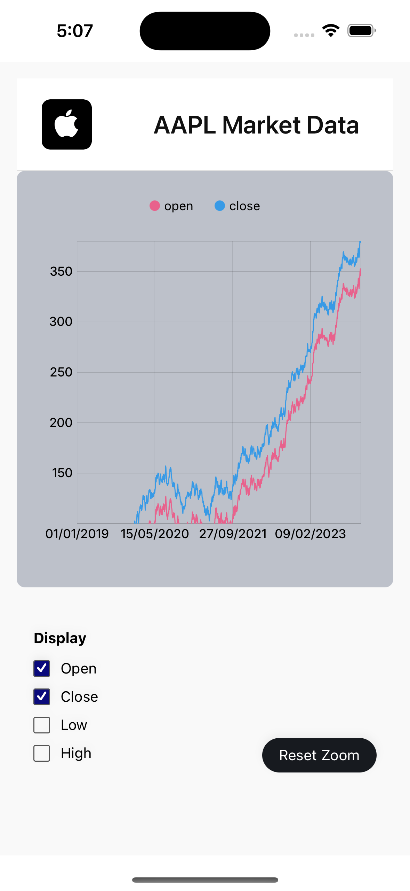
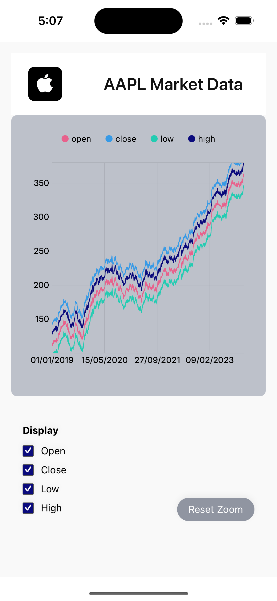

# Market Chart Application

This project is a **React Native application** developed as a **test assignment** to demonstrate skills in building interactive data visualizations with modern mobile technologies. It features a market chart displaying historical stock data for Apple (AAPL), allowing users to visualize key metrics and interact with the chart.

---

## Screenshots

Take a look at these screenshots to see the application in action:

| **Initial Chart View** | **Zoomed Chart View** |
|:----------------------:|:---------------------:|
|  |  |

---

## Implemented Features & Technical Approach

We've successfully implemented the following core features and utilized these technologies to build a robust and interactive market chart:

### **Dynamic Chart Visualization**
* **What was done:** Displays historical stock data for AAPL with multiple lines (Open, Close, Low, High).
* **How it was done:** Utilized **`victory-native`** for rendering the chart, which leverages **`@shopify/react-native-skia`** for high-performance 2D graphics. This choice ensures smooth animations and efficient rendering on both iOS and Android.

### **Toggleable Data Lines**
* **What was done:** Users can select which specific data lines (e.g., 'Close', 'Low', 'High') are visible on the chart.
* **How it was done:** Implemented **Redux Toolkit** for managing the `display` state, allowing the chart to dynamically re-render based on user preferences. Each line's visibility is controlled by a boolean flag in the Redux store.

### **Interactive Zoom (Simulated)**
* **What was done:** The chart features a tap-to-toggle zoom functionality, allowing a closer look at data trends.
* **How it was done:** A `zoomed` boolean state, managed in the **Redux store**, controls a zoom factor applied to the Y-axis points. This demonstrates state management for interactive chart behaviors.

### **Crosshair / Press State for Data Inspection**
* **What was done:** When a user presses and holds on the chart, a vertical line (crosshair) appears, indicating the pressed X-coordinate.
* **How it was done:** Leveraged `useChartPressState` from **`victory-native`** to capture press events and obtain the exact position, which is then used to render a custom `VerticalLine` component over the chart.

### **Robust State Management with Redux Toolkit**
* **What was done:** Centralized and managed application state, including chart display options and zoom, in a predictable manner.
* **How it was done:** Implemented **Redux Toolkit** with a `displaySlice` to handle actions like `toggleLine` and `toggleZoom`, ensuring a single source of truth for UI state.

### **API Integration & Data Handling**
* **What was done:** Fetches historical AAPL stock data from a remote API.
* **How it was done:** Used **Redux Toolkit Query** (`useGetAAPLHistoryQuery`) to streamline API requests, caching, and loading state management, significantly reducing boilerplate code.

### **Error Handling & Loading States**
* **What was done:** Provides clear visual feedback during data fetching and in case of network or API errors.
* **How it was done:** We integrated `isLoading`, `isError`, and `error` states from Redux Toolkit Query to conditionally render an `ActivityIndicator` for loading and user-friendly error messages with a retry button.

### **Type Safety with TypeScript**
* **What was done:** Ensured code quality and reduced runtime errors throughout the application.
* **How it was done:** The entire project is written in **TypeScript**, providing strong type checking for props, state, API responses, and Redux actions.

---

## Setup and Installation

Follow these steps to get the project up and running on your local machine:

1.  **Clone the repository:**
    ```bash
    git clone <your-repository-url>
    cd <your-project-folder>
    ```

2.  **Install dependencies:**
    ```bash
    npm install
    # or
    yarn install
    ```

3.  **Install CocoaPods (for iOS development):**
    ```bash
    cd ios && pod install && cd ..
    ```

4.  **Run the application:**

    **Important Note:** This project uses `react-native-skia` (via `victory-native`), which relies on native modules. **Therefore, it cannot be run directly with Expo Go.** You'll need a React Native development environment to run it on a simulator/emulator or a physical device.

    * **For iOS:**
        ```bash
        npx react-native run-ios
        ```
    * **For Android:**
        ```bash
        npx react-native run-android
        ```

---

## Usage

* Upon launching the app, you'll see a chart displaying AAPL's historical data.
* **Toggle Lines**: The legend at the top indicates which lines are currently displayed. While interactive toggles aren't implemented in the provided legend, you can extend the `LegendDot` component or add separate controls to `dispatch(toggleLine(...))` to control line visibility.
* **Zoom**: Tap anywhere on the chart area to **toggle the zoom** effect. The "Reset Zoom" button will appear when zoomed in, allowing you to return to the default view. *Please note: Currently, this is a simulated zoom effect. Full price/date-based zooming is a planned future enhancement.*
* **Data Inspection**: Press and hold on the chart to activate the crosshair and inspect the data point at that specific X-coordinate.

---

## Future Enhancements & Areas for Improvement

Based on the current implementation, here are key areas identified for future development and refinement to elevate the application's capabilities and user experience:

* **True Price and Date-Based Zoom**: Transform the current simulated zoom into a genuine, data-driven zoom. This involves dynamically adjusting the chart's visible range (both price and date axes) based on user interaction, allowing for precise exploration of specific timeframes and value ranges.
* **Sophisticated Tooltip**: Develop a beautiful and informative tooltip component that appears upon long-pressing a chart point. This tooltip will display all relevant data (date, open, close, low, high) in a well-styled and easy-to-read pop-up.
* **Custom Line Styles**: Implement support for various custom line styles, such as arc-like or curved lines, to provide more visually appealing and flexible chart representations beyond simple straight lines.
* **Enhanced Animations and Gestures**: Introduce more fluid and engaging animations for line toggles, zoom transitions, and the appearance/disappearance of the tooltip. Explore additional intuitive gestures, such as horizontal panning or pinch-to-zoom, for improved chart navigation.
* **NativeWind Integration**: Refactor styling using **NativeWind** (or a similar utility-first CSS-in-JS solution). This transition aims to streamline development, promote cleaner and more consistent styling, and leverage Tailwind CSS's benefits in a React Native context.
* **Comprehensive Testing Suite**: Develop a robust set of tests, including:
    * **Unit Tests** for API calls (`marketApi.ts`) to ensure data fetching logic is sound.
    * **Component Tests** for interactive elements like buttons (`ZoomButton.tsx`) to verify correct behavior.
    * **Integration/UI Tests** for the `MarketChart` component to confirm proper data rendering and user interaction responses.
* **Offline Support with Async Storage**: Implement data caching using **Async Storage**. This will allow the application to display previously loaded data when offline and provide a faster initial load time for returning users.
* **Environment Variable Management**: Securely manage sensitive information, such as API keys, by implementing `.env` files. This prevents hardcoding credentials directly into the codebase and ensures better security practices.
* **Code Refactoring and Documentation**: Conduct a thorough refactoring of the codebase to improve overall readability, maintainability, and overall code quality. Add comprehensive **inline comments** to explain complex logic, component responsibilities, and key decisions, significantly enhancing clarity for future development and team collaboration.

---

## License

This project is licensed under the **MIT License** - see the [LICENSE](LICENSE) file for details.

---

## Contributing

Feel free to fork this repository, submit pull requests, or open issues. We welcome contributions to make this project even better!